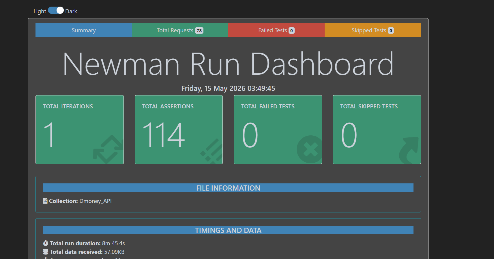
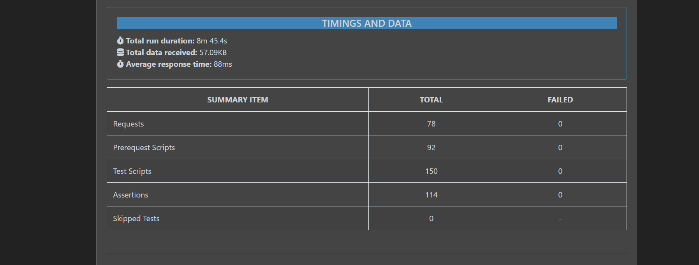

#  DMONEY REST API Testing (Postman)

##  Overview
This project demonstrates automated testing of the **DMoney REST API** using Postman. It includes API test cases for authentication, user management, and financial transactions such as Send Money, Deposit, and Withdraw.

The project also supports command-line execution using Newman for CI/CD integration.

---

##  Features
- 🔐 Admin,System,User Login(Agent,Customer) & Authentication
- 📧 Email Verification & OTP Validation
- 💸 Send Money
- 💸 Deposit Money
- 💵 Withdraw from Agent
- 🔁 Environment & Collection Variables
- ✅ Automated Test Scripts (Assertions)
- ⏱️ Delay handling for OTP expiry testing
- 💻 Newman CLI support

---

##  Tools & Technologies
- Postman — Used for API request creation, testing, and automation  
- Newman — Used to run Postman collections via CLI and for CI/CD integration  
- REST API — Defines the communication between client and server using HTTP methods  
- JavaScript (Postman scripting) — Used to write test scripts, assertions, and automate workflows 

---
1. ## 📄 API Documentation

Postman published documentation:[Documentation](https://documenter.getpostman.com/view/52925547/2sBXqQFHkL)


2. ## 🧾 Test Cases :[Test Case Document].(https://docs.google.com/spreadsheets/d/1LP3woIQPpDCe4W9cZ3WS52WcOiDOZbFV/edit?usp=sharing&ouid=114831411539983234280&rtpof=true&sd=true)

3. ## Report




   
---
## ▶️ How to Run

Follow the steps below to run the project locally:

### Clone the Repository
```bash
git clone https://github.com/Ummejami/DMONEY_API-by-Potman.git
cd DMONEY_API-by-Potman
```
### Install Dependencies
```bash
npm install
```
### Configure Environment Variable
1. Create a .env file in the project root directory
2. Add necessary environment variables (G_API)

### Run The Test
```bash
npm test
```
